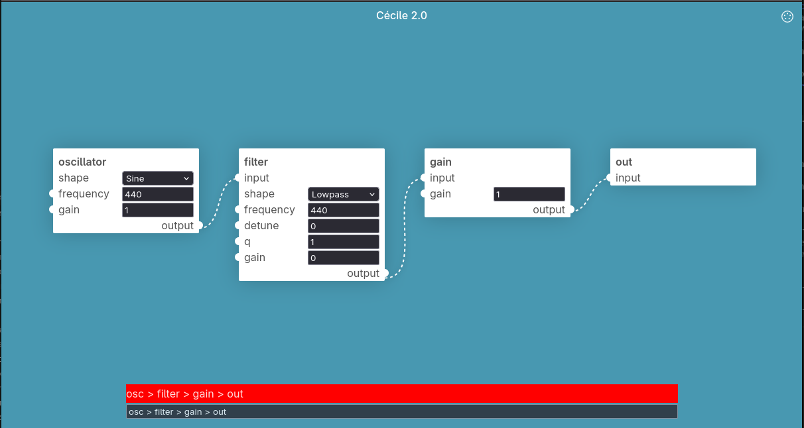

# Cécile

**A modular synth in your browser that you can patch by typing.**

Cécile is a web-based modular synthesizer editor inspired by [Pure Data](https://puredata.info/).
You place audio modules on a canvas and wire them together, like in any patcher. You can also
skip the mouse: a small command language lets you create, select and connect modules by typing
short commands into a console.

```
osc > f > g > out
```

That one line creates an oscillator, a filter, a gain and an output, and wires them in series.

**Try it live → [cecile.t4sty.it](https://cecile.t4sty.it)**



## Features

- **Patch by typing.** A compact, fuzzy-matched command language for building patches quickly.
- **Patch by hand.** Drag wires between inlets and outlets, rubber-band select nodes and move them around.
- **Real Web Audio.** Every module is backed by Web Audio API nodes or `AudioWorklet`s, and edits are applied live.
- **MIDI in.** MIDI input modules plus one-key **MIDI learn**.

## Getting started with Cécile lang

Press <kbd>Space</kbd> to focus the command line, type a command and hit <kbd>Enter</kbd>.

### Your first patch

```
oscillator > filter > gain > out
```

**Every module name can be abbreviated.** Names are fuzzy-matched, so this does the same thing:

```
osc > f > g > out
```

### Setting parameters

Add `@name=value` after a module:

```
osc @shape=sawtooth @frequency=110 > f @frequency=800 @q=8 > g @gain=0.2 > out
```

Parameter names, and values when they are strings, are also fuzzy-matched, so you can write also

```
osc @s=saw @f=110 > f @f=800 @q=8 > g @g=0.2 > out
```

### Creating many modules at once

Prefix a module with `<count>*`. Inside a parameter expression, `n` is the module's 1-based
position in the batch (`z` is the 0-based one and `r` is a random number). Expressions support
`+ - * / ^` and parentheses. This makes a four-partial additive organ:

```
4*osc @frequency=110*n > g @gain=0.1 > out
```

### Labels, selectors and specific inlets

Give a module a label with `:label`. Use `$name` to select modules that **already exist**
instead of creating new ones. Write `inlet{` after a connector to target an input other than
the default one (or `}outlet` before it to pick an output):

```
osc:lfo @frequency=0.5 @gain=400 > freq{ $f
```

This adds a slow LFO and routes it into the existing filter's cutoff frequency.

### A small generative patch

```
noise > g:range @gain=12 > sh
clock @bpm=240 > trigger{ $sh
$sh > q @scale=pentatonic > mtof > frequency{ osc > g:vca @gain=0.2 > out
```

A clock samples random values, which are quantized to a pentatonic scale, converted from MIDI
notes to Hz and used to play an oscillator.

### Connectors

| Connector | Meaning |
|-----------|---------|
| `>`, `<`  | connect every module on the left to every module on the right |
| `=`       | connect modules pairwise, one-to-one (`2*osc = 2*g`) |

📖 **The full syntax (connectors, inlet/outlet targeting, expressions, selectors and more) is
documented in the [Cécile language reference](docs/language.md).**

## Modules

### Sources

| Module | Description |
|--------|-------------|
| `oscillator` | Periodic waveform (`sine`, `triangle`, `square`, `sawtooth`) with modulatable `frequency` and output `gain`. |
| `noise` | White noise. |
| `constant` | Outputs a constant `value`. Useful as a control signal. |
| `clock` | Pulse train at a given `bpm` and `pulseWidth`. |

### Processing

| Module | Description |
|--------|-------------|
| `filter` | Biquad filter (`lowpass`, `highpass`, `bandpass`, `lowshelf`, `highshelf`, `peaking`, `notch`, `allpass`) with `frequency`, `q`, `gain` and `detune`. |
| `gain` | Amplifier / VCA. Its `gain` can be modulated by a signal. |
| `delay` | Delay line with modulatable `time`. |
| `ahr` | Slew / envelope follower. Rises towards the input at the `attack` rate, falls at the `release` rate, and stays within 0–1. Feed it a gate to get an envelope. |
| `clip` | Clamps the signal between `min` and `max`. |
| `samphold` | Sample & hold. Captures the input on each rising edge of `trigger` that crosses `threshold`. |
| `quantizer` | Snaps a signal (in semitones) to the nearest note of a `scale` (`major`, `minor harmonic`, `pentatonic`), after adding `offset`. |
| `mtof` | Converts MIDI note numbers to frequency in Hz. |

### Outputs

| Module | Description |
|--------|-------------|
| `out` | Sends the signal to your speakers. |
| `display` | Logs its input value to the browser console under a `label`. Handy for debugging control signals. |

### MIDI input

All MIDI modules have a `device` and a `channel` param. Leave either empty to accept any device or channel.

| Module | Outputs |
|--------|---------|
| `midi-note-in` | `frequency` and `velocity` of the last note received. |
| `midi-keyboard-in` | Like `midi-note-in`, but keeps track of held notes (last-note priority) and applies pitch bend (`pitchRange` in semitones). |
| `midi-cc-in` | `value` of a control change (filter by `cc` number). |
| `midi-pitch-in` | Pitch-bend `pitch`. |
| `midi-aftertouch-in` | Channel aftertouch `pressure`. |
| `midi-poly-aftertouch-in` | Polyphonic aftertouch `note` and `pressure`. |
| `midi-pc-in` | Program change `program`. |
| `midi-sys-message-in` | Status byte of system messages. |

## MIDI learn

You don't need to remember which MIDI module to use. Press <kbd>m</kbd> (or click the MIDI
button), then move a control on your MIDI device. Cécile works out what kind of message it
received and places the matching module under your mouse cursor, with `device`, `channel`
and (for CCs) the `cc` number already filled in:

| You touch… | You get… |
|------------|----------|
| a key | `midi-keyboard-in` |
| a knob / fader (CC) | `midi-cc-in` with its `cc` number |
| the pitch wheel | `midi-pitch-in` |
| aftertouch | `midi-aftertouch-in` / `midi-poly-aftertouch-in` |
| a program change | `midi-pc-in` |
| a system message | `midi-sys-message-in` |

MIDI requires a browser that supports the [Web MIDI API](https://caniuse.com/midi), and you'll
be asked for permission the first time.

## Keyboard shortcuts

| Key | Action |
|-----|--------|
| <kbd>Space</kbd> | Focus the command console |
| <kbd>m</kbd> | Start MIDI learn |

## Development

Cécile is built with React, TypeScript and Vite, and uses [bun](https://bun.sh) as package manager
and test runner. The command language grammar is written with [Peggy](https://peggyjs.org/).

### Prerequisites

- [bun](https://bun.sh). If you use Nix, `nix-shell` drops you into a shell with everything you need.

### Install & run

```sh
bun install
bun run dev        # start the dev server at http://localhost:5173
```

Audio starts after your first click on the page, because browsers block autoplay.

### Other scripts

```sh
bun test           # run the test suite
bun run lint       # ESLint (zero warnings allowed)
bun run build      # typecheck + production build into dist/
bun run preview    # serve the production build locally
bun run parser     # regenerate src/lib/lang/parser.ts from grammar.pegjs
```

If you edit `src/lib/lang/grammar.pegjs`, run `bun run parser` afterwards. The generated parser
is checked in and should not be edited by hand.

### Project layout

```
src/
├── lib/lang/          # grammar.pegjs, generated parser, and exec.ts (AST → graph changes)
├── lib/commands/      # module definitions (node/nodes/*) and meta commands
├── lib/audio_graph/   # reconciles the patch graph with the live Web Audio graph
├── lib/midi/          # MIDI parsing and MIDI-learn logic
├── data/              # plain, serializable Node / Param / Edge / Graph model
├── components/        # canvas (AppGraph), console input, MIDI-learn button, …
└── screens/           # splash and graph editor pages
docs/                  # language reference
infra/                 # Terraform for the hosting / CDN setup
```

### Adding a module

Each module lives in `src/lib/commands/node/nodes/` and exports a `Node` with two parts:
`params()` describes its inlets, outlets and parameters, and `build(audioContext)` returns the
audio node that implements it. Register the module in `nodes/index.ts` and it will appear in
the console's autocomplete. Look at `gain.ts` for a minimal example, or `clip/` for one that
uses an `AudioWorklet`.

## Contributing

Issues and pull requests are welcome! Before opening a PR, please make sure that `bun test`,
`bun run lint` and `bun run build` all pass.
